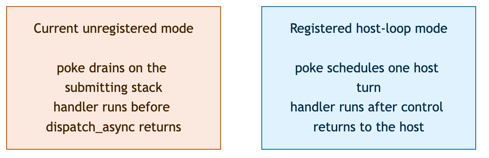

# Host-driven Dispatch on single-threaded WASI

This experiment responds to the execution-model question raised on
[swiftlang/swift-corelibs-libdispatch#953](https://github.com/swiftlang/swift-corelibs-libdispatch/pull/953#issuecomment-5516561885).
The current WASI backend drains from a queue poke. A registered host now has an
alternative: the poke requests a later host callback, control returns to the
host, and the callback performs Dispatch work.

The experiment is opt-in so the combined branch remains a stable comparison.
Without a registered scheduler, its eager behavior and existing tests are
unchanged.

## Execution model

The host-facing contract has three operations:

- `_dispatch_wasi_event_loop_set_scheduler` registers one callback before
  asynchronous Dispatch use. The callback queues a host turn and must return
  without calling back into Dispatch.
- `_dispatch_wasi_event_loop_perform` harvests already-visible source events and
  runs a configurable number of drain phases. Scheduler callbacks consume the
  outstanding-turn latch; timer callbacks preserve it.
- `_dispatch_wasi_event_loop_next_timer_delay` returns a relative nanosecond
  delay, or `-1` when no timer is armed. This avoids sharing clock epochs across
  the Wasm boundary.

Dispatch owns wakeup coalescing. If work remains after a perform call, one
scheduler callback is either retained or requested before perform returns.

## What the reactor test proves

The Node test instantiates a WASI reactor and supplies the scheduler through a
`dispatch_host.schedule` import. It checks that:

- `dispatch_async` returns before its handlers run.
- Multiple submissions request one initial host callback.
- A one-phase budget advances root work one item at a time.
- A timer-only submission programs and fires through a host-owned timeout.
- A timer callback cannot consume or duplicate an outstanding scheduler turn.
- Inline callbacks and scheduler registration during Dispatch execution fail
  with named diagnostics.

## Deliberate limits

This is an architecture probe for the PassiveLogic fork. The SPI names and
callback shape are open for review.

One manager or main-queue phase can drain a captured queue snapshot, so the
budget is a drain-phase budget rather than a strict callback limit. The pump
uses zero-timeout fd harvesting, but it cannot wake an idle JavaScript host when
an fd becomes ready later. Browser fd readiness needs a separate host adapter.
Blocking Dispatch waits keep the combined branch's existing cooperative policy.
