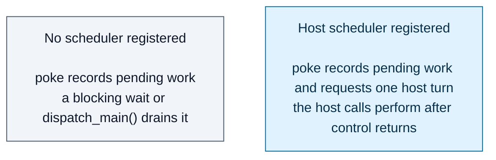
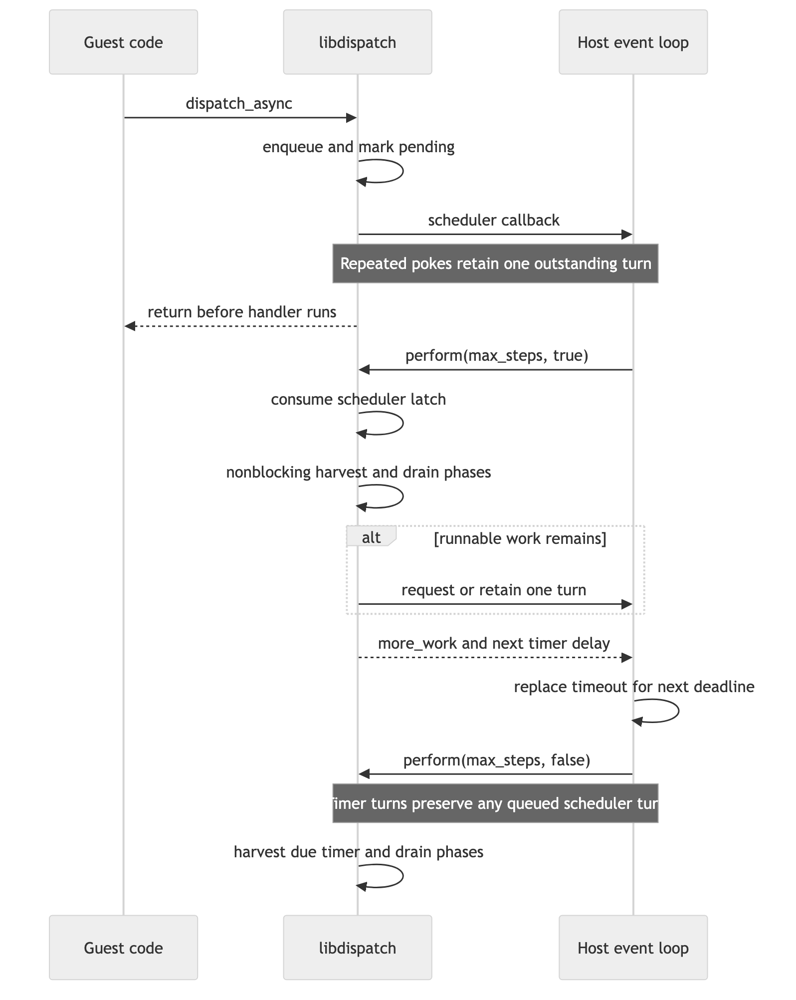

# Host-driven Dispatch on single-threaded WASI

This design responds to the execution-model question raised on
[swiftlang/swift-corelibs-libdispatch#953](https://github.com/swiftlang/swift-corelibs-libdispatch/pull/953#issuecomment-5516561885).
A queue poke never drains. It records pending work and, when a host
scheduler is registered, requests a later host callback. Control returns to
the host, and the callback performs Dispatch work. Without a registered
scheduler, pending work waits for the next pump point: a blocking Dispatch
wait or `dispatch_main()`.

This is the only submission model in the port. An earlier iteration drained
on poke and needed bracket hooks around eight critical sections in shared
code; those hooks are gone.

## Execution model

The host-facing contract has three operations:

- `_dispatch_wasi_event_loop_set_scheduler` registers one callback. The
  callback queues a host turn and must return without calling back into
  Dispatch. Work recorded before registration is handed over at
  registration.
- `_dispatch_wasi_event_loop_perform` harvests already-visible source events and
  runs a configurable number of drain phases. Scheduler callbacks consume the
  outstanding-turn latch; timer callbacks preserve it.
- `_dispatch_wasi_event_loop_next_timer_delay` returns a relative nanosecond
  delay, or `-1` when no timer is armed. This avoids sharing clock epochs across
  the Wasm boundary.

Dispatch owns wakeup coalescing. If work remains after a perform call, one
scheduler callback is either retained or requested before perform returns.

## What the reactor test proves

The Node test instantiates a WASI reactor and supplies the scheduler through a
`dispatch_host.schedule` import. It checks that:

- `dispatch_async` returns before its handlers run.
- Multiple submissions request one initial host callback.
- Work submitted before registration requests exactly one turn at
  registration and runs on it.
- Registration from inside a running work item requests no turn itself; the
  drain step hands over the work still pending when it ends.
- A one-phase budget advances root work one item at a time.
- A timer-only submission programs and fires through a host-owned timeout.
- A timer callback cannot consume or duplicate an outstanding scheduler turn.
- An inline callback fails with a named diagnostic.

## Deliberate limits

The SPI names and callback shape are open for review.

One manager or main-queue phase can drain a captured queue snapshot, so the
budget is a drain-phase budget rather than a strict callback limit. The pump
uses zero-timeout fd harvesting, but it cannot wake an idle JavaScript host when
an fd becomes ready later. Browser fd readiness needs a separate host adapter.
Blocking Dispatch waits at top level still pump, and hand any work they
leave pending to the host.
